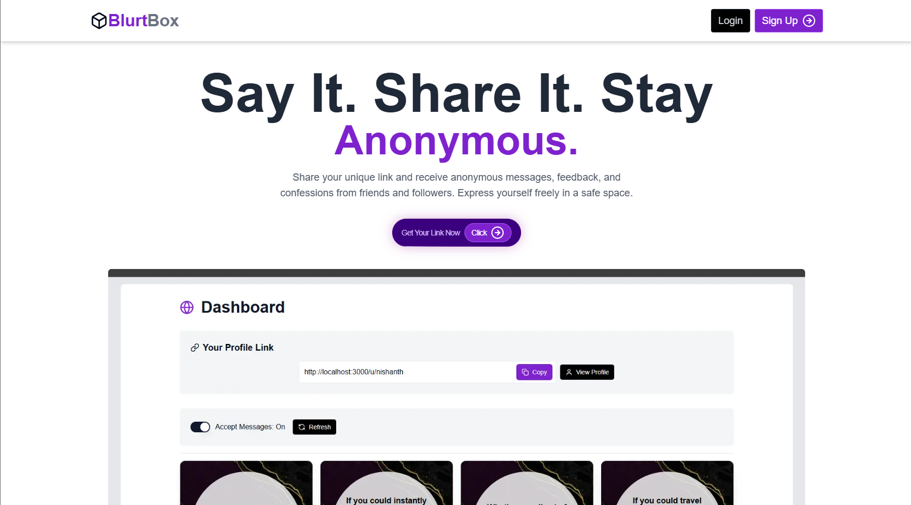
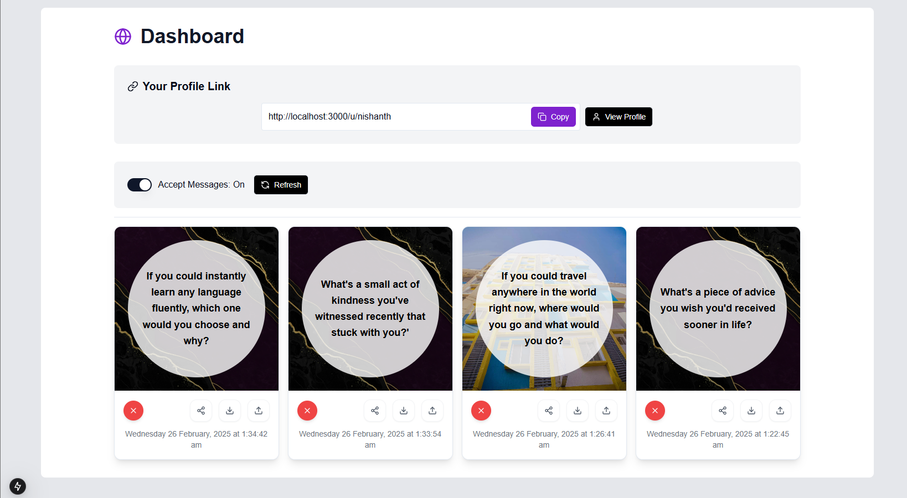
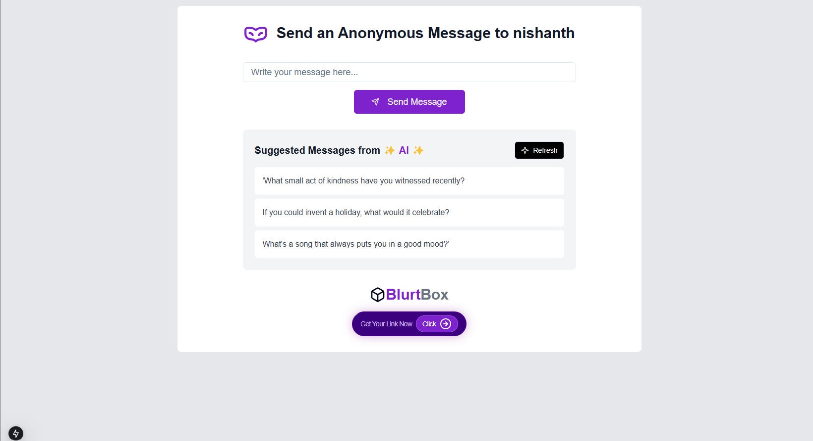
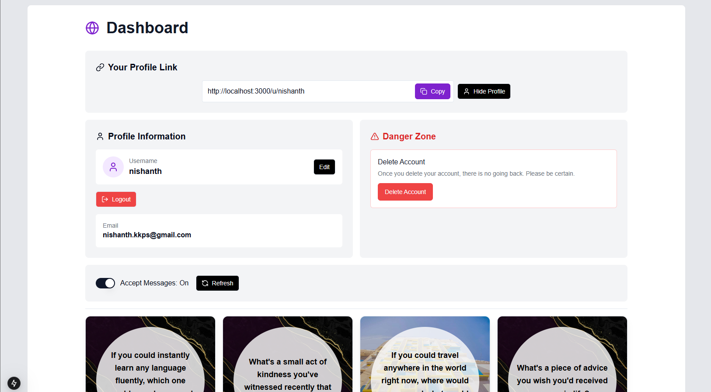

# Blurt Box

Blurt Box is a **Next.js + TypeScript** application that allows users to receive **anonymous messages** through a unique public link. Built with **MongoDB, ShadCN, and Gemini API**, Blurt Box offers a sleek, interactive dashboard for managing received messages.

## Features

### 🚀 Core Functionality
Blurt Box allows users to create a public link for receiving ***anonymous messages.*** It integrates **Gemini AI** for message suggestions and offers a ***secure authentication*** system for login and registration.

### 📊 User Dashboard
Registered users can manage received messages in their dashboard, enabling or disabling message reception as needed. They can refresh the message list, delete unwanted messages, ***share directly to social media***, ***download as PNG***, and ***customize message card backgrounds.*** Users can also update their username or permanently delete their account, with each user assigned a ***unique public URL***.

### 🔗 Message Sending
Senders remain ***anonymous***. Gemini AI offers ***message suggestions***, which can be refreshed for more options.

## 🛠️ Tech Stack


## 📦 Installation

### Prerequisites
- **Node.js 18 || >20** & **npm**
- **Docker** (optional)
- **Environment variables** (add in .env)
    ```
    MONGODB_URL=
    RESEND_API_KEY=
    NEXTAUTH_SECRET=
    GOOGLE_API_KEY=
    ```

### Docker 
    docker build -t blurt-box .
    docker run -p 3000:3000 blurt-box

### GitHub
1. Clone the repository:
   ```sh
   https://github.com/nishanthhks/Blurt-Box.git
   cd blurt-box
   ```
2. Install dependencies:
   ```sh
   npm install
   ```
3. Run locally:
   ```sh
   npm run dev
   ```
<div style="display: flex; flex-wrap: wrap; justify-content: center; align-items: center;">
  
  
  
  
</div>
